# ERP System

This is the ERP System code base, which serves as the backend for an ecommerce application. It provides the necessary functionality for managing products, orders, customers, and more.

## Installation

1. Clone the repository: `git clone https://github.com/your-username/ecommerce-admin.git`
2. Install the dependencies: `npm install`

## Usage

1. Start the server: `npm run dev`
2. Access the admin dashboard at: `http://localhost:5173`

## Features

- Dashboard - Provides an overview of the system's features.
- Products Management - Allows for the management of product listings.
- Orders Management - Facilitates viewing and handling orders.
- Additionally, as an optional feature, you may implement:
- Orders Calendar View - A calendar interface displaying orders based on their expected delivery dates.

## Screenshots
- ## Dashboard

- ## Products Management
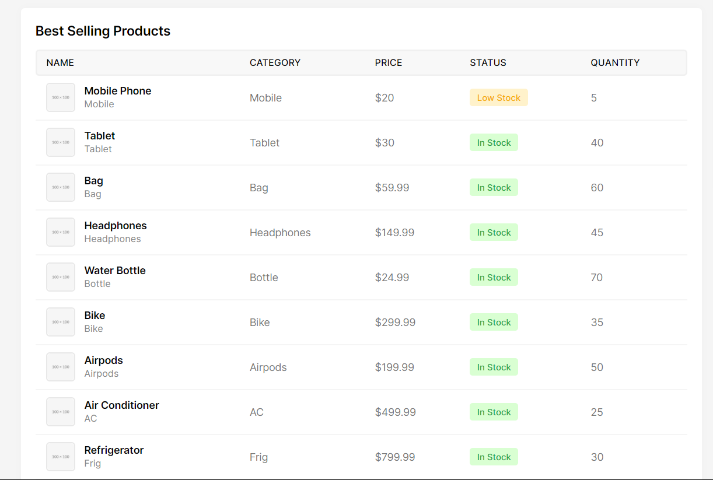

- ## Products Listing
 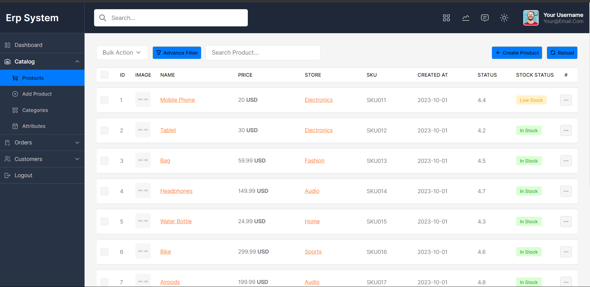

- ## Edit Update and Delete Products
 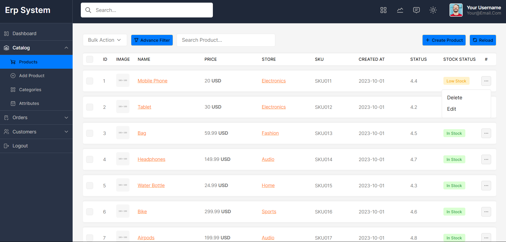
  
  - ## Edit Page 
  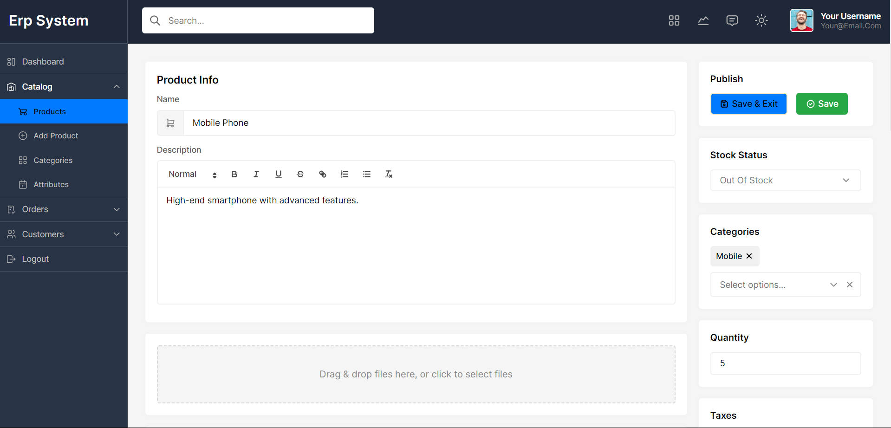

  - ## Add New Product
  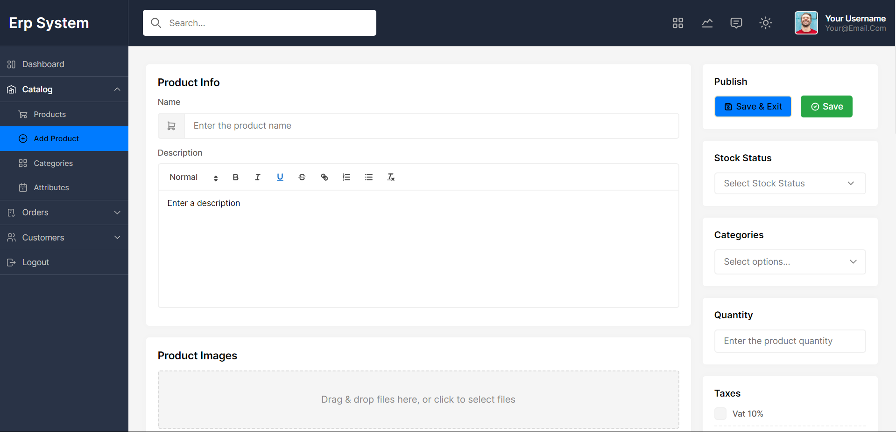
 
  - ## Delete Product
  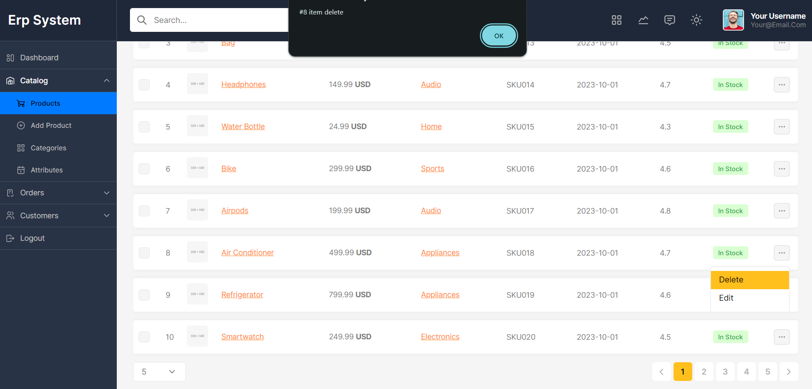

- ## Orders Management
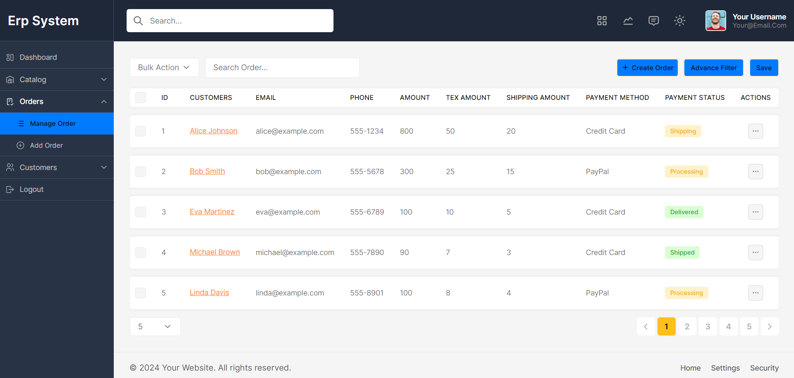

 - ## Order Update status,Deletion of orders

 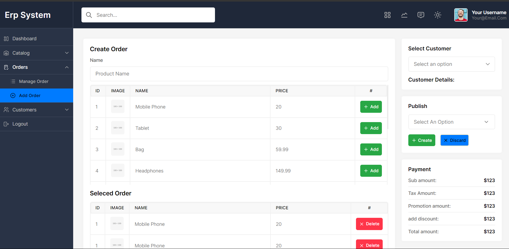

 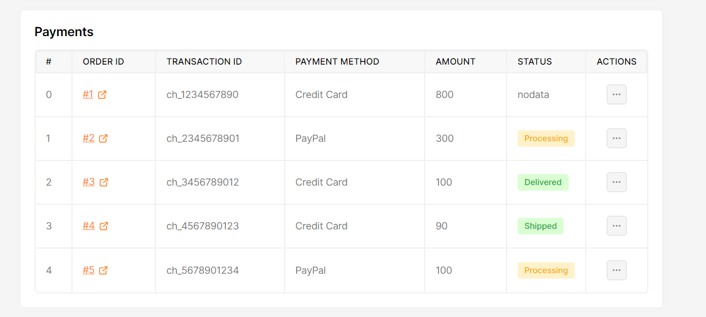

- ## Orders Calendar View

- 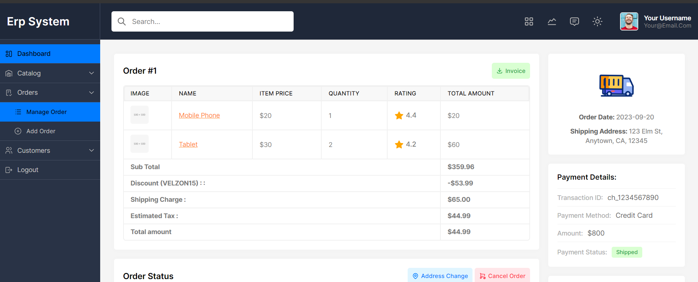
- 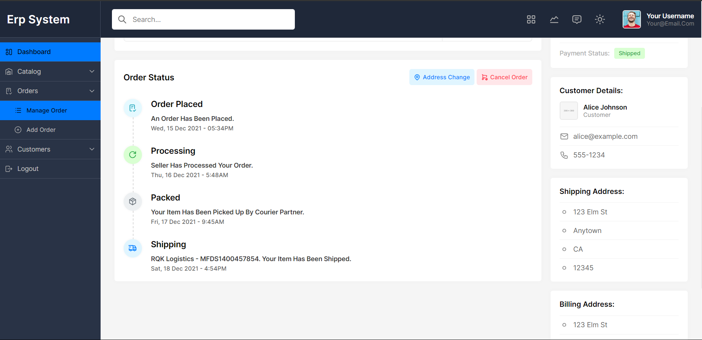

- ## Customers Management
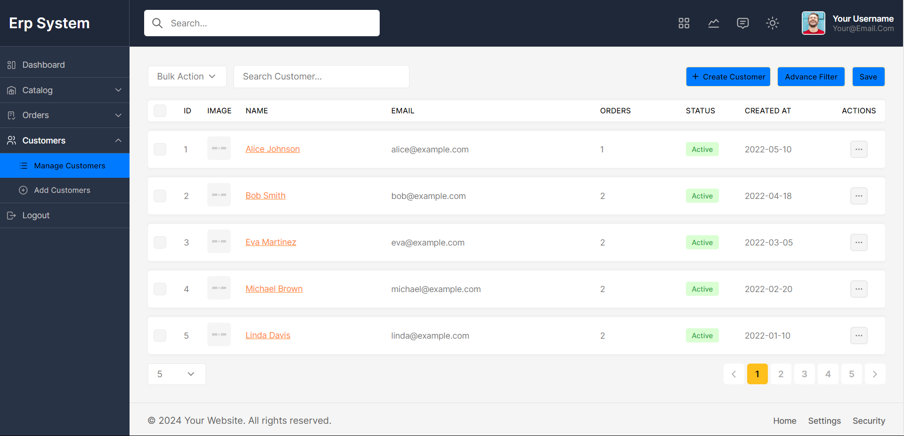

## Contributing

Contributions are welcome! If you find any bugs or have suggestions for new features, please open an issue or submit a pull request.

## License

This project is licensed under the [MIT License](LICENSE).

## Contact

For any questions or inquiries, please contact the project maintainer at [email@example.com](mailto:email@example.com).